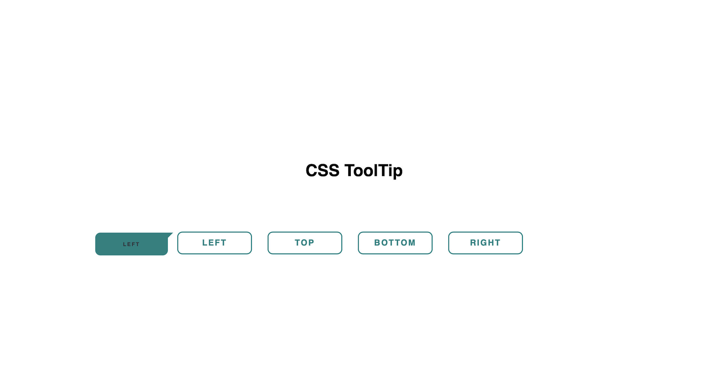
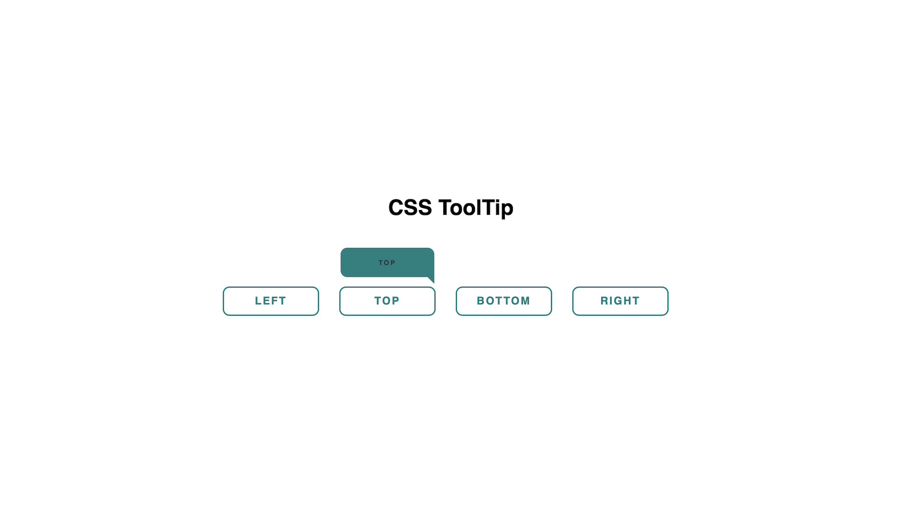
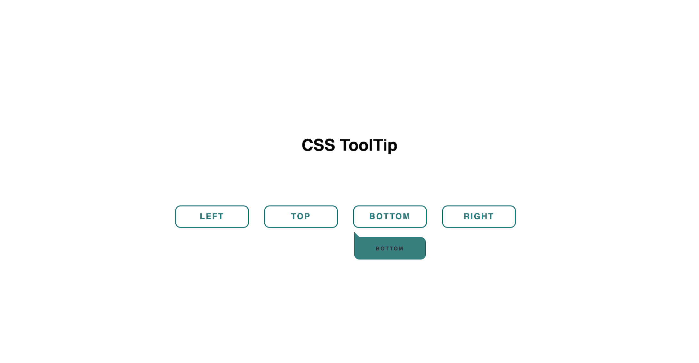
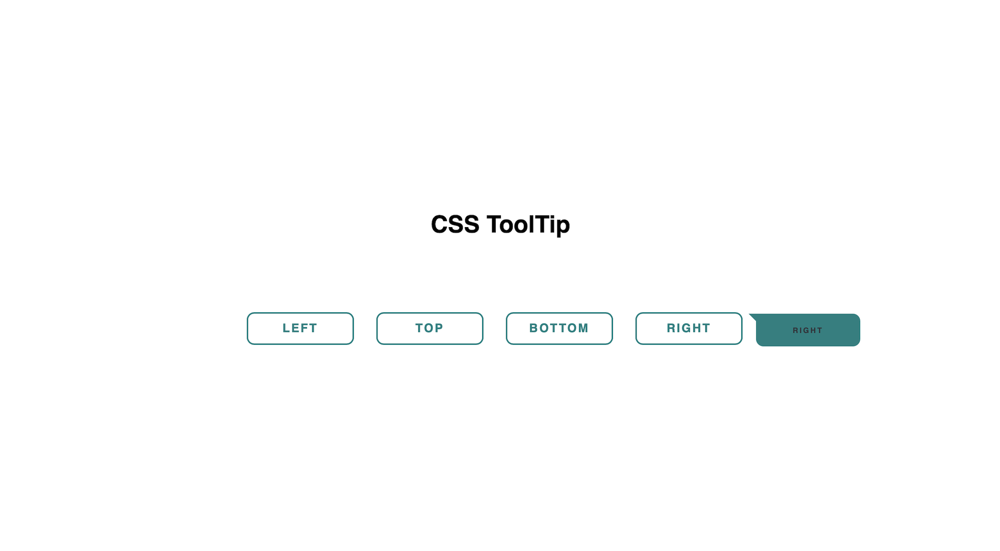

# CSS Tooltip Demo
This project demonstrates a CSS-based tooltip feature with directional tooltips (top, bottom, left, and right). The tooltips appear with smooth transitions when hovering over buttons.

## Features
Pure CSS implementation
Customizable tooltip directions: Top, Bottom, Left, and Right.
Smooth animations with opacity and transitions.
Responsive and styled with a modern aesthetic.

## How to Use
Clone the repository:
git clone https://github.com/Summi51/Masai_Alumni_Quick_Revision/tree/main/HTML_CSS/ToolTip
Open the ToolTip.html file in any browser.
Hover over the buttons to view the tooltips.

## UI Preview

## Folder Structure

css-tooltip-demo/
├── ToolTip.html          # Main HTML file
├── ToolTip.css         # CSS for the tooltips
└── README.md           # Project documentation

